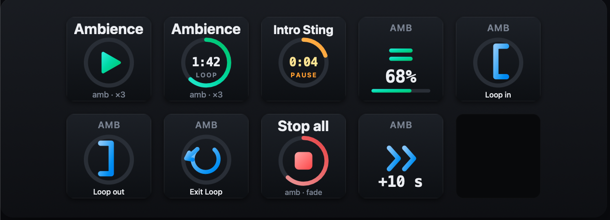
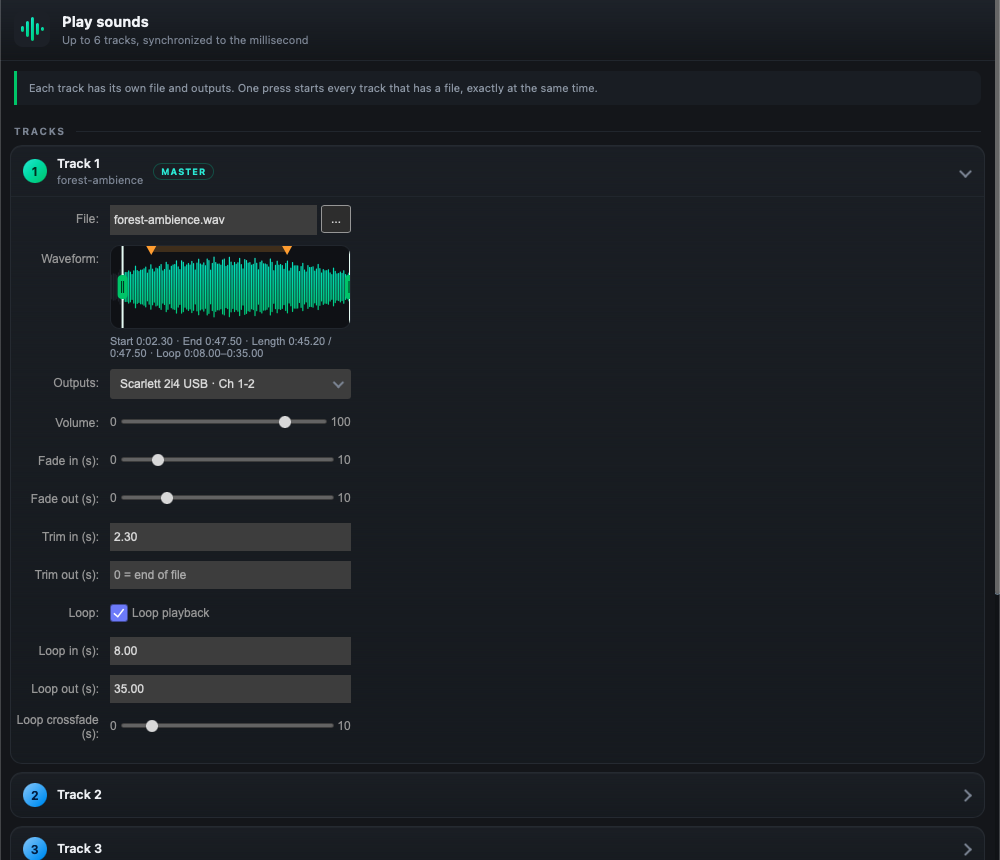

# SAAP — advanced audio player for Stream Deck

Play several audio files at once from a single key, send each one to the audio interface and outputs you choose,
and control it live. Works on **macOS** and **Windows**.



## Install

1. Download **`com.saap.audio.streamDeckPlugin`** from the [latest release](../../releases/latest).
2. Double-click it: the Stream Deck app installs the plugin.
3. Look for the **SAAP Audio** category in the action list.

Requirements: macOS 12+ (Apple Silicon and Intel) or Windows 10/11, and Stream Deck 6.5 or later.

> **macOS:** the audio engine is not notarized by Apple. The plugin removes the quarantine flag itself on startup,
> but if macOS still shows "Apple could not verify saap-engine", open System Settings → Privacy & Security
> and click "Open Anyway".

### Windows

The same `com.saap.audio.streamDeckPlugin` file installs on both macOS and Windows. It uses WASAPI (no ASIO) and
has not yet been validated on real audio hardware: feedback is welcome. The plugin logs are in
`%appdata%\Elgato\StreamDeck\Plugins\com.saap.audio.sdPlugin\logs`.

## How it works

The plugin adds several kinds of key/dial to the **SAAP Audio** category. **Play Sound** is the actual player;
everything else is a *control* that acts on sounds already started by a Play Sound key, rather than playing
anything itself.

- **Play Sound**: holds up to 6 tracks. Assign a file to track 1 (and, optionally, more files to tracks 2-6) in
  its settings, then press the key — every track with a file starts together, in sync to the millisecond. Each
  track has its own output, volume, fades, and trim/loop points, set from that same panel or drawn directly on
  its waveform.

  The panel in the Stream Deck app is narrow: press **Open large editor** at its top to get the same settings in
  your browser, laid out wide — a much bigger waveform to place trim and loop points on, and all six tracks side
  by side. Both stay in sync (a change in one shows up in the other), and the editor has a **Browse…** button that
  opens the system's file dialog. It is served by the plugin on `127.0.0.1` only, behind a random per-launch token,
  and stops working when Stream Deck quits.

  
- **Groups** are how a control reaches the right sounds. Give a Play Sound key a group name in its settings; a
  control key (Volume, Skip forward/back, Set Loop Point, Exit Loop, Stop all) set to that same group only
  affects sounds started from keys in that group, while one left on "all sounds" reaches everything currently
  playing. This is what lets, say, one Stop All key fade out just the "ambience" group while a separate key stops
  everything.
- **Routing**: each track is sent to one or several outputs — an audio interface, and a specific stereo pair or
  single channel on it — so a single key press can, for instance, send a click track to a monitor mix while the
  rest goes to the main output.
- **Looping**: trim in/out crops the file to a range; loop in/out (independent from trim) marks a sub-range
  within it that repeats, with an optional crossfade to mask the seam. Set either by typing seconds into the
  panel, by dragging the handles on the waveform, or — while the track is already playing — by pressing
  **Set Loop Point** to capture the current position live, so a loop can be tapped in by ear instead of by
  number.

## Features

- **Play sound** (key):
  - up to 6 tracks per key, started together within a millisecond (mono or stereo files);
  - per-track routing to one or **several outputs** (audio interface + stereo pair or single channel);
  - fade in / fade out, **trim in / trim out** points placed on a waveform, loop;
  - **loop in / loop out** points, independent from trim: play from trim-in, loop between loop-in and
    loop-out, then (once **Exit Loop** is pressed) finish the current pass and play through to trim-out
    instead of wrapping again — handy for a musical intro/loop/outro structure;
  - **loop crossfade**: on every wrap, blends the tail past loop-out into the head at loop-in instead of a
    hard cut, so the loop's rhythmic length stays exact — masks the click of a loop point that isn't a
    zero crossing, more musically than a fade to silence and back;
  - live volume per track, countdown or elapsed time with a progress ring on the key;
  - key behavior while playing: stop (with fade), pause / resume, or restart;
  - track 1 can act as a **master**: its trim points, loop points (independently linkable), fades
    (including the loop fade) and volume can be linked to the other tracks.
- **Volume** (key or dial): master volume or per-group volume, mute. Dial: rotate = volume, press = mute.
- **Skip forward / back** (key or dial): jump within running playbacks; all tracks move together and stay in sync.
- **Set Loop Point** (key): marks the current playback position as the loop-in or loop-out point, live, for every
  running track matching a group (all sounds, or one group) — and turns Loop on for it. Does nothing if nothing
  matching is playing.
- **Exit Loop** (key): stops looping playbacks (all, or one group) — each finishes its current pass, then plays
  through to its trim-out point. Has no effect on a track that isn't looping.
- **Stop all** (key): all sounds or one group, with a fade or an immediate cut. Give each button its own name to
  have several stop buttons.
- **Update check**: the plugin looks on GitHub for a newer release (one anonymous request at startup, then daily;
  pre-releases are ignored) and shows a bar at the top of the settings panel and of the large editor, with
  **Install** (downloads the package and opens it — Stream Deck asks you to confirm) and **What's new**. It can be
  switched off in the panel's *Updates* section.
- **Groups**: a free name per sound; "stop the group's other sounds on start" gives exclusive playback.

## Architecture

- [`engine/`](engine) — native macOS audio engine in Objective-C (one `AVAudioEngine` per playback, channel routing
  through a CoreAudio channel map).
- [`engine-rs/`](engine-rs) — Windows audio engine in Rust (`cpal` + `symphonia`, WASAPI). It also builds on macOS,
  which is how it is tested.
- [`plugin/`](plugin) — TypeScript plugin (Elgato SDK): it launches the engine, drives keys and dials, and serves the
  settings panels.

Both engines speak the same protocol: one JSON command per line on stdin, one JSON event per line on stdout.
The plugin picks `saap-engine` (macOS) or `saap-engine.exe` (Windows) at runtime.

## Build

```bash
./engine/build.sh                            # macOS engine → plugin/com.saap.audio.sdPlugin/bin/saap-engine
cd engine-rs && cargo build --release        # Windows engine (run on Windows, or use the CI)
cd plugin && npm install && npm run build    # bundles bin/plugin.js
```

The settings panels in `plugin/com.saap.audio.sdPlugin/ui/` are generated by `plugin/tools/gen-inspector.py`.

## Package and release

```bash
./package.sh    # builds dist/com.saap.audio.streamDeckPlugin (macOS engine only, when run locally)
```

Pushing a tag such as `v0.2.0` runs the [GitHub Actions workflow](.github/workflows/release.yml), which builds both
engines, assembles a single package for macOS and Windows, and attaches it to the release. A tag with a dash
(`v0.2.0-beta.1`) is published as a pre-release.

## Development install

```bash
# macOS
ln -s "$PWD/plugin/com.saap.audio.sdPlugin" "$HOME/Library/Application Support/com.elgato.StreamDeck/Plugins/com.saap.audio.sdPlugin"
```

Then quit and restart the Stream Deck app. Logs are in `com.saap.audio.sdPlugin/logs/`.

## License

[MIT](LICENSE) © 2026 Florian Sauvé. Third-party software included in or used to build the plugin is listed, with
its license, in [THIRD-PARTY-NOTICES.md](THIRD-PARTY-NOTICES.md).
